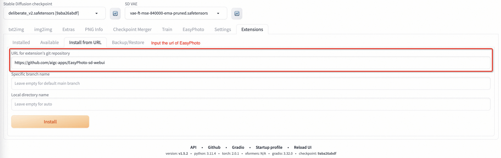

# 📷 EasyPhoto | Your Smart AI Photo Generator.

# Introduction

English | [简体中文](./README_zh-CN.md)

EasyPhoto is a Webui UI plugin for generating AI portraits that can be used to train digital doppelgangers relevant to you. Training is recommended to be done with 5 to 20 portrait images, preferably half-body photos and do not wear glasses (It doesn't matter if the characters in a few pictures wear glasses). After the training is done, we can generate it in the Inference section. We support using preset template images or uploading your own images for Inference.

These are our generated results:

Our ui interface is as follows:  
**train part:**

**inference part:**

# What's New
- Create Code! Support for Windows and Linux Now. [🔥 2023.09.02]

# TODO List
- Support chinese ui.
- Support change in template's background.
- Support high resolution.
- Support multi-person templates.

# Quick Start
### 1. Environment Check
We have verified EasyPhoto execution on the following environment:   

The detailed of Windows 10:  
- OS: Windows10
- python: py3.10
- pytorch: torch2.0.1
- tensorflow-cpu: 2.13.0
- CUDA: 11.7
- CUDNN: 8+
- GPU: Nvidia-3060 12G

The detailed of Linux:  
- OS: Ubuntu 20.04, CentOS
- python: py3.10 & py3.11
- pytorch: torch2.0.1
- tensorflow-cpu: 2.13.0
- CUDA: 11.7
- CUDNN: 8+
- GPU: Nvidia-A10 24G & Nvidia-V100 16G & Nvidia-A100 40G

We need about 60GB available on disk (for saving weights and datasets process), please check!

### 2. Relevant Repositories & Weights Downloading
#### a. Controlnet 
We need to use Controlnet for inference. The related repo is [Mikubill/sd-webui-controlnet](https://github.com/Mikubill/sd-webui-controlnet). You need install this repo before using EasyPhoto.

In addition, we need at least three Controlnets for inference. So you need to set the **Multi ControlNet: Max models amount (requires restart)** in Setting.

#### b. Other Dependencies.
We are mutually compatible with the existing stable-diffusion-webui environment, and the relevant repositories are installed when starting stable-diffusion-webui.

The weights we need will be downloaded automatically when you start training first time.

### 3. Plug-in Installation
Now we support installing EasyPhoto from git. The url of our Repository is https://github.com/aigc-apps/EasyPhoto-sd-webui.

We will support installing EasyPhoto from **Available** in the future.

# Algorithm Detailed

### 1.Architectural Overview

In the field of AI portraits, we expect model-generated images to be realistic and resemble the user, and traditional approaches introduce unrealistic lighting (such as face fusion or roop). To address this unrealism, we introduce the image-to-image capability of the stable diffusion model. Generating a perfect personal portrait takes into account the desired generation scenario and the user's digital doppelgänger. We use a pre-prepared template as the desired generation scene and an online trained face LoRA model as the user's digital doppelganger, which is a popular stable diffusion fine-tuning model. We use a small number of user images to train a stable digital doppelgänger of the user, and generate a personal portrait image based on the face LoRA model and the expected generative scene during inference. 

### 2.Training Detailed

First, we perform face detection on the input user image, and after determining the face location, we intercept the input image according to a certain ratio. Then, we use the saliency detection model and the skin beautification model to obtain a clean face training image, which basically consists of only faces. Then, we label each image with a fixed label. There is no need to use a labeler here, and the results are good. Finally, we fine-tune the stabilizing diffusion model to get the user's digital doppelganger.   

During training, we utilize the template image for verification in real time, and at the end of training, we calculate the face id gap between the verification image and the user's image to achieve Lora fusion, which ensures that our Lora is a perfect digital doppelganger of the user.

In addition, we will choose the image that is most similar to the user in the validation as the face_id image, which will be used in Inference.

### 3.Inference Detailed
#### a.First Diffusion:  
First, we will perform face detection on our incoming template image to determine the mask that needs to be inpainted for stable diffusion. then we will use the template image to perform face fusion with the optimal user image. After the face fusion is completed, we use the above mask to inpaint (fusion_image) with the face fused image. In addition, we will affix the optimal face_id image obtained during training to the template image by affine transformation (replaced_image). Then we will apply Controlnets on it, we use canny with color to extract features for fusion_image and openpose for replaced_image to ensure the similarity and stability of the images. Then we will use Stable Diffusion combined with the user's digital split for generation.

#### b.Second Diffusion:
After getting the result of First Diffusion, we will fuse the result with the optimal user image for face fusion, and then we will use Stable Diffusion again with the user's digital doppelganger for generation. The second generation will use higher resolution.

## Reference
- insightface：https://github.com/deepinsight/insightface    
- cv_resnet50_face：https://www.modelscope.cn/models/damo/cv_resnet50_face-detection_retinaface/summary  
- cv_u2net_salient：https://www.modelscope.cn/models/damo/cv_u2net_salient-detection/summary 
- cv_unet_skin_retouching_torch：https://www.modelscope.cn/models/damo/cv_unet_skin_retouching_torch/summary   
- cv_unet-image-face-fusion：https://www.modelscope.cn/models/damo/cv_unet-image-face-fusion_damo/summary  
- kohya：https://github.com/bmaltais/kohya_ss
- controlnet-webui：https://github.com/Mikubill/sd-webui-controlnet
        
# License

This project is licensed under the [Apache License (Version 2.0)](https://github.com/modelscope/modelscope/blob/master/LICENSE).
