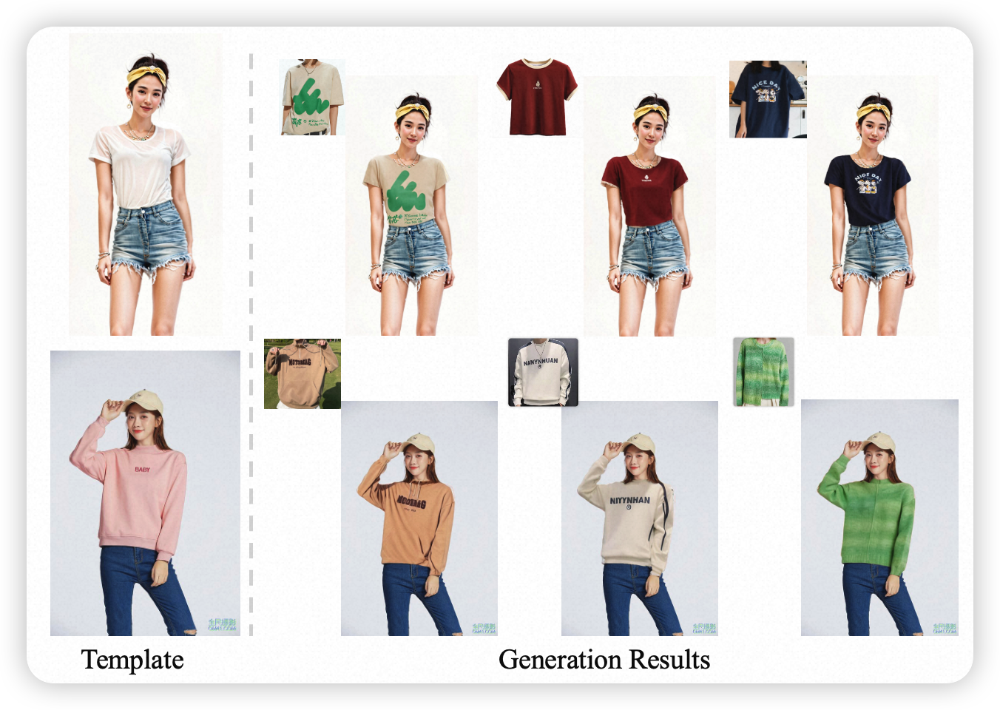
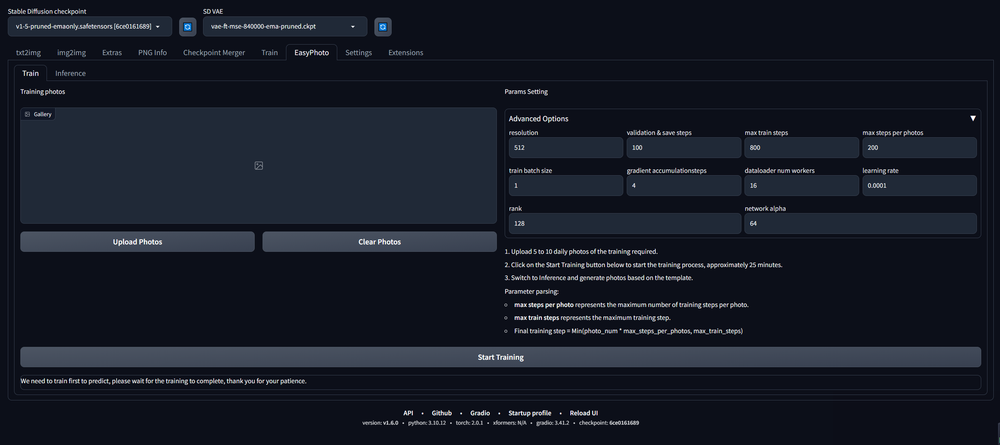
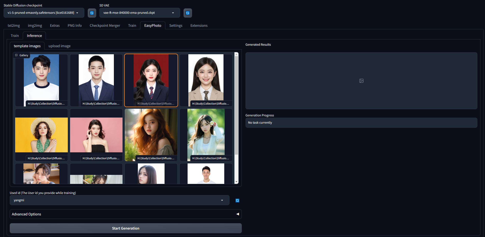
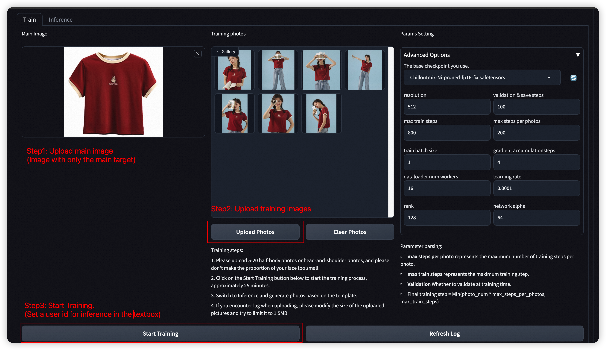
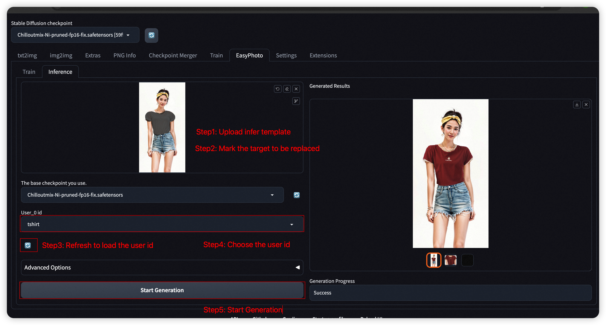

# EasyPhoto | 您的智能 AI 照片生成器 (AnyId)。
🦜 EasyPhoto是一款Webui UI插件，用于生成AI肖像画，该代码可用于训练与您相关的数字分身。

本分支用于扩展EasyPhoto的流程，以适应任意的id（不仅仅是人脸）。

我们在虚拟试衣领域进行尝试，并将持续优化效果，欢迎关注讨论。

文档所用图片仅用于效果演示，如有侵权，烦请告知，立刻删除。

🦜 🦜 Welcome!

[English](./README.md) | 简体中文

# 目录
- [简介](#简介)
- [TODO List](#todo-list)
- [快速启动](#快速启动)
    - [1. 云使用: AliyunDSW/AutoDL/Docker](#1-云使用-aliyundswautodldocker)【暂未支持】
    - [2. 本地安装: 环境检查/下载/安装](#2-本地安装-环境检查下载安装)
- [如何使用](#如何使用)
    - [1. 模型训练](#1-模型训练)
    - [2. 人物生成](#2-人物生成)
- [算法详细信息](#算法详细信息)
    - [1. 架构概述](#1-架构概述)
    - [2. 训练细节](#2-训练细节)
    - [3. 推理细节](#3-推理细节)
- [参考文献](#参考文献)
- [相关项目](#相关项目)
- [许可证](#许可证)
- [联系我们](#联系我们)

# 简介
EasyPhoto是一款Webui UI插件，用于生成AI肖像画，该代码可用于训练与您相关的数字分身。我们对EasyPhoto进行进一步扩展，来支持任意Id的图像生成。您只需要提供少量的带有主体（id）的训练图片，我们将首先训练一个包含id信息的LoRA模型。基于该LoRA模型，可任意的替换模版图片中的指定区域。我们在虚拟试衣领域进行初步尝试，并将持续优化算法效果。

请阅读我们的开发者公约，共建美好社区 [covenant](./COVENANT.md) | [简体中文](./COVENANT_zh-CN.md)

如果您在训练中遇到一些问题，请参考 [VQA](https://github.com/aigc-apps/sd-webui-EasyPhoto/wiki)。

我们现在支持从不同平台快速启动，请参阅 [快速启动](#快速启动)。

这些是我们的生成结果:


我们的ui界面如下:
**训练部分:**

**预测部分:**



# 快速启动

## a. 通过docker
使用docker的情况下，请保证机器中已经正确安装显卡驱动与CUDA环境，然后以此执行以下命令：
```
# 拉取镜像
docker pull registry.cn-shanghai.aliyuncs.com/pai-ai-test/eas-service:ubuntu2204-cuda117-torch201-sdwebui-anyid01

# 进入镜像
docker run -it -p 7860:7860 --network host --gpus all registry.cn-shanghai.aliyuncs.com/pai-ai-test/eas-service:ubuntu2204-cuda117-torch201-sdwebui-anyid01

# 启动webui
python launch.py --xformers
```

如您已经拉取了EasyPhoto master中提供的镜像，可进入EasyPhoto目录切换至anyid分支。并参考[LightGlue安装](#install-lightglue) 安装lightglue 即可使用。
请注意，镜像中的代码未必为最新版本，您可在EasyPhoto目录中运行下面的命令来更新相关代码。

```
cd extensions/sd-webui-EasyPhoto/
# 切换分支
git checkout -b anyid remotes/origin/anyid

# 更新代码
git pull

cd /workspace
```

### 2. 本地安装: 环境检查/下载/安装
#### a. 环境检查
我们已验证EasyPhoto可在以下环境中执行：
如果你遇到内存使用过高而导致WebUI进程自动被kill掉，请参考[ISSUE21](https://github.com/aigc-apps/sd-webui-EasyPhoto/issues/21)，设置一些参数，例如num_threads=0，如果你也发现了其他解决的好办法，请及时联系我们。

Linux 的详细信息：
- 操作系统 Ubuntu 20.04, CentOS
- python: python3.10 & python3.11
- pytorch: torch2.0.1
- tensorflow-cpu: 2.13.0
- CUDA: 11.7
- CUDNN: 8+
- GPU： Nvidia-A10 24G & Nvidia-V100 16G & Nvidia-A100 40G

我们需要大约 60GB 的可用磁盘空间（用于保存权重和数据集），请检查！

#### b. 相关资料库和权重下载
##### i. Controlnet
我们需要使用 Controlnet 进行推理。相关软件源是[Mikubill/sd-webui-controlnet](https://github.com/Mikubill/sd-webui-controlnet)。在使用 EasyPhoto 之前，您需要安装这个软件源。


##### ii. 其他依赖关系。
我们与现有的 stable-diffusion-webui 环境相互兼容，启动 stable-diffusion-webui 时会安装相关软件源(除LightGlue外)。

我们所需的权重会在第一次开始训练时自动下载。

- LightGlue 安装

[LightGlue](https://github.com/cvg/LightGlue) 用来在训练时对图像进行预处理. 您需要在运行EasyPhoto的anyid 版本之前手动安装lightglue。
(由于新版本lightglue仓库缺少安装文件，且仅支持从github链接中下载模型，如您安装遇到困难，我们推荐您从下面的包进行直接安装）。

```
wget https://pai-vision-data-sh.oss-cn-shanghai.aliyuncs.com/aigc-data/easyphoto/models/LightGlue.zip
unzip LightGlue.zip
cd LightGlue
python -m pip install -e .
```

#### c. 插件安装
我们支持从 git 安装 EasyPhoto。我们的仓库网址是 https://github.com/aigc-apps/sd-webui-EasyPhoto。


# 如何使用
### 1. 模型训练
EasyPhoto训练界面如下：
- 左边是训练图像。您需要上传主体图片和训练图片来训练模型。
- 右边是训练参数，不能为第一次训练进行调整。

主体图像用于与训练图像中的目标区域匹配，用于分割目标ID的区域。因此，请选择一张干净、清晰的正面图像作为主体图像。接下来，点击“上传照片”按钮以上传训练图像，这些训练图像将通过LightGlue和SAM进行处理，以获取主要目标。然后，我们在下方点击“开始训练”，在这一步，我们需要填写上方的用户ID，比如用户的姓名，以开始训练。



如果要设置参数，每个参数的解析如下：
| 参数名 | 含义 |
|--|--|
| resolution  | 训练时喂入网络的图片大小，默认值为512 |
| validation & save steps| 验证图片与保存中间权重的steps数，默认值为100，代表每100步验证一次图片并保存权重 |
| max train steps | 最大训练步数，默认值为800 |
| max steps per photos | 每张图片的最大训练次数，默认为200 |
| train batch size | 训练的批次大小，默认值为1 |
| gradient accumulationsteps | 是否进行梯度累计，默认值为4，结合train batch size来看，每个Step相当于喂入四张图片 |
| dataloader num workers | 数据加载的works数量，windows下不生效，因为设置了会报错，Linux正常设置 |
| learning rate  | 训练Lora的学习率，默认为1e-4 |
| rank Lora | 权重的特征长度，默认为128 |
| network alpha | Lora训练的正则化参数，一般为rank的二分之一，默认为64 |

### 2. 模型推理

- 步骤1：点击刷新按钮，查询训练后的用户ID对应的模型。
- 步骤2：选择用户ID。
- 步骤3：选择需要生成的模板，并标记需要替换的目标区域。
- 步骤4：单击“生成”按钮生成结果。



# 算法详细信息
TBD

# 参考文献
- insightface：https://github.com/deepinsight/insightface
- cv_resnet50_face：https://www.modelscope.cn/models/damo/cv_resnet50_face-detection_retinaface/summary
- cv_u2net_salient：https://www.modelscope.cn/models/damo/cv_u2net_salient-detection/summary
- cv_unet_skin_retouching_torch：https://www.modelscope.cn/models/damo/cv_unet_skin_retouching_torch/summary
- cv_unet-image-face-fusion：https://www.modelscope.cn/models/damo/cv_unet-image-face-fusion_damo/summary
- kohya：https://github.com/bmaltais/kohya_ss
- controlnet-webui：https://github.com/Mikubill/sd-webui-controlnet

# 相关项目
我们还列出了一些很棒的开源项目以及任何你可能会感兴趣的扩展项目：
- [ModelScope](https://github.com/modelscope/modelscope).
- [FaceChain](https://github.com/modelscope/facechain).
- [sd-webui-controlnet](https://github.com/Mikubill/sd-webui-controlnet).
- [sd-webui-roop](https://github.com/s0md3v/sd-webui-roop).
- [roop](https://github.com/s0md3v/roop).
- [sd-webui-deforum](https://github.com/deforum-art/sd-webui-deforum).
- [sd-webui-additional-networks](https://github.com/kohya-ss/sd-webui-additional-networks).
- [a1111-sd-webui-tagcomplete](https://github.com/DominikDoom/a1111-sd-webui-tagcomplete).
- [sd-webui-segment-anything](https://github.com/continue-revolution/sd-webui-segment-anything).
- [sd-webui-tunnels](https://github.com/Bing-su/sd-webui-tunnels).
- [sd-webui-mov2mov](https://github.com/Scholar01/sd-webui-mov2mov).

# 许可证
本项目采用 [Apache License (Version 2.0)](https://github.com/modelscope/modelscope/blob/master/LICENSE).

# 联系我们
1. 使用[钉钉](https://www.dingtalk.com/)搜索群38250008552或扫描下列二维码加入群聊
2. 由于 微信群 已经满了，需要扫描右边的图片先添加这个同学为好友，然后再加入 微信群 。
<figure>


</figure>
